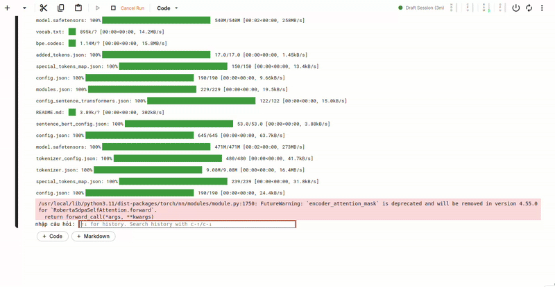

<p align="center">
 <h1 align="center">LLM Q&A about Viettel telecom package information</h1>
</p>

[](https://github.com/Tung003/LLM-Q-A/blob/main/LICENSE)

## Introduction

Here is my python source code for LLM Question and Answer about Viettel telecom package information:

* Run a Web applications that are publicly accessible via domain name or IP.
* RAG (Retrieval Augmented Generation) with custom dataset.
* Deploy on AWS free (EC2) with FastAPI.
* The model used: https://huggingface.co/nguyenvulebinh/vi-mrc-large

## Web app
<p align="justify">
Due to the lack of powerful hardware and a limited budget for renting high-performance machines on AWS, using small and lightweight models for deployment is a practical choice. However, this comes with the trade-off of slightly lower performance or quality.
</p>

<p align="justify">
However, if you have access to more powerful hardware or want to experiment with higher-performance models, you can try using larger ones like https://huggingface.co/vilm/vinallama-2.7b-chat. I’ve also included support for this model in the following section.
</p>

<p align="center">
  <br/>
  <i>Web app demo</i>
</p>

## Test vinallama-2.7b-chat

In this test, the model in normal mode returns the full response only after the entire output has been generated. [✨ vinallama-2.7b-chat notebook](./RAG_answer_package_infor.ipynb)


<p align="justify">
To run this model you need to have the appropriate hardware such as T4 GPU or A100 GPU from Google Colab
</p>

<table align="center">
  <tr>
    <td align="center" width="45%">
      <br>
    </td>
    <td align="center" width="45%">
      <br>
    </td>
  </tr>
</table>
<p align="center"><em>Test vinallama 2.7b chat</em></p>

In contrast, in streaming mode, the model outputs words in real-time, displaying them immediately as they are generated.  [🚀 vinallama-2.7b-chat stream](./RAG_module_stream.py)

<p align="center">
  <br/>
  <i>Web app demo</i>
</p>

<p align="center"><em>Test vinallama 2.7b chat mode stream</em></p>

## Dataset
The dataset crawl by BeautifulSoup and Selenium and Data is saved in json file with the following structure:
```json
{
  "text": "information package",
  "metadata": {
    "url": "url package",
    "title": "name package"
  }
}

```
Then convert the data into structured formats to make it easier for embedding into the vector store and retrieving from it.

Such as:
```json
{
    "conversations": [
      {
        "role": "user",
        "content": "Tôi muốn biết thông tin về gói cước ST70K?"
      },
      {
        "role": "assistant",
        "content": "Thông tin của gói cước ST70K:\nTên gói cước: ST70K chi tiết:\nƯu đãi\nGiá cước:\n 70.000đ\n(Đối với thuê bao trả sau: Đăng ký từ ngày 21 đến cuối tháng sẽ giảm 50% phí gói và có 500MB/ngày)\nƯu đãi:\n- 500MB data tốc độ cao/ngày, hết lưu lượng ngừng truy cập.\n- Gói cước tự động gia hạn khi hết chu kỳ (Không bảo lưu data khi gia hạn thành công)\n- Ưu đãi sử dụng trong 30 ngày (trả trước), hết tháng (trả sau).\nĐăng ký: \nBấm Đăng ký, soạn ST70K gửi 191, bấm gọi *098*174#.\nHủy gia hạn\n: Bấm \"Hủy\" hoặc soạn HUY gửi 191.\nHủy gói: \nSoạn tin HUYDATA gửi 191. \nNếu cần chi tiết hơn bạn có thể vào trang web chính thức của Viettel biết thêm thông tin :https://viettel.vn/vx/di-dong/goi-data/ST70K"
      }
    ]
  }
```
Or:
```json
{
    "text": "Gói cước gia hạn sau 180 ngày",
    "metadata": {
      "url": "https://viettel.vn/vx/di-dong/goi-data/6M10_100M",
      "title": "6M10_100M",
      "section": "Gia hạn"
    }
  }
```
